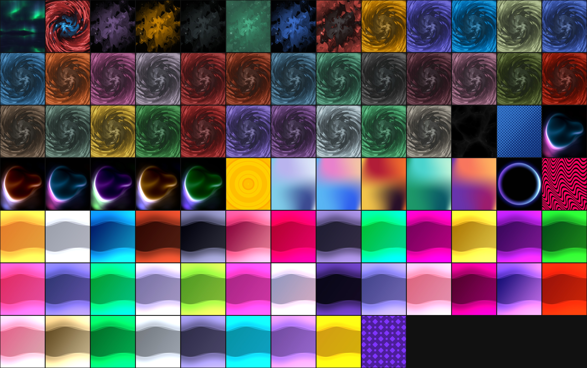

# shader2thor

Converts shaders into a two-screen wallpaper videos for Ayn Thor.

[](EXAMPLES.md)

See [EXAMPLES.md](EXAMPLES.md) for previews and downloads of every shader currently in `output/`.

## Requirements

```bash
pip install moderngl numpy Pillow
```

`ffmpeg` must be available on `PATH`.

## Usage

Single shader:

```bash
python render_wallpaper.py shaders/main.frag output
```

Whole folder of shaders (batch):

```bash
python render_wallpaper.py shaders output
```

The input type (a `.frag` file or a directory) is auto-detected. Flags:

| Flag | Default | Meaning |
|---|---|---|
| `--duration` | see [Loop durations](#loop-durations) | Clip length, seconds |
| `--fps` | `30` | Frames per second |
| `--crf` | `5` | Encoding quality (lower = better) |
| `--start` | `0.0` | `iTime` offset at frame 0 |
| `--nvenc` | off | Encode on the GPU (`h264_nvenc`) instead of `libx264` |
| `--top` | `1920x1080` | Top screen size as `WxH` |
| `--bottom` | `1240x1080` | Bottom screen size as `WxH` |
| `--gap` | `82` | Vertical gap between screens, in px |
| `--no-mosaic` | off | Skip rebuilding the combined preview mosaic |
| `--no-examples` | off | Skip rebuilding `EXAMPLES.md` |
| `--examples` | `EXAMPLES.md` next to the script | Where to write the examples list |

Canvas resolution isn't a flag itself — it's derived from `--top`/`--bottom`/`--gap` (see [Device geometry](#device-geometry)).

Shaders can be organized in subfolders under `shaders/` (e.g. `shaders/balatro/arcana.frag`); batch mode picks them up recursively, and single-file mode preserves the subfolder in the output path (`output/balatro/arcana/`).

## Loop durations

`shaders/loops.json` maps a shader name to its exact loop period in seconds:

```json
{ "aurora": 40.0, "pew": 6.283185307179586 }
```

When `--duration` isn't passed, a shader listed there renders for exactly that long (so the clip loops seamlessly); anything not listed falls back to 20 seconds. Passing `--duration` explicitly overrides this for every shader in the run.

## Variations

A single shader can be rendered in several named variations by passing different values into GLSL **uniforms**. Instead of a bare number, give the shader an object in `loops.json` with a shared `duration` and a `variations` map — each entry is a name plus the uniform values for that look:

```json
"psp-original": {
  "duration": 30.159289474462014,
  "variations": {
    "pink":     { "uTheme": 1 },
    "slate":    { "uTheme": 2 },
    "midnight": { "uTheme": 8 }
  }
}
```

The renderer compiles the shader once and renders every variation, setting its uniforms before each render. Each variation lands in its own subfolder named after the variation (see [Output](#output)).

For this to work the shader must **declare and use the uniform** it's driven by. `psp-original.frag`, for example, exposes `uniform int uTheme;` and selects one of its 34 color themes from it at runtime. Uniform values map to GLSL types by JSON shape: a number sets an `int`/`float`, and an array sets a `vecN` (e.g. `"colour_1": [0.85, 0.2, 0.2, 1.0]`). A uniform a variation lists but the shader doesn't declare is ignored.

Uniforms persist on the reused program between variations, so each variation should set the full set of uniforms it depends on rather than relying on another variation's leftover values.

## Output

A shader with no variations gets its own subfolder with three files:

```
output/
  main/
    main_preview.png   # full-frame still (top + gap + bottom), first frame at t = --start
    main_top.mp4        # crop video for the top screen
    main_bottom.mp4      # crop video for the bottom screen
```

A shader with variations nests one level deeper, one subfolder per variation:

```
output/
  psp-original/
    pink/
      pink_preview.png
      pink_top.mp4
      pink_bottom.mp4
    slate/
      slate_preview.png
      ...
```

Same layout for single-file and batch mode. The preview PNG isn't a throwaway — it's part of the output.

Re-running a batch always re-renders everything — there's no caching or skipping of already-rendered shaders.

## Generated docs

When a run finishes, two files are regenerated from the previews found under the output root:

- `output/all_previews_mosaic.jpg` — every `*_preview.png` tiled into one contact sheet (the image at the top of this README)
- `EXAMPLES.md` — one section per variant, with its preview and links to both videos

Both are built from the whole output tree rather than just the current run, so rendering a single shader still refreshes them completely. Skip either with `--no-mosaic` / `--no-examples`.

To rebuild them from an existing output tree without rendering anything:

```bash
python build_docs.py output
```

It takes the same `--no-mosaic`, `--no-examples` and `--examples` flags.

Note that both are derived from whatever is in the output root you point at — rendering into a scratch directory with the defaults would rewrite the repo's `EXAMPLES.md` from just that directory's contents. Pass `--no-examples` or `--examples` when rendering somewhere other than the real output root.

## Device geometry

Defaults target the AYN Thor: top screen `1920x1080`, bottom screen `1240x1080`, `82`px gap between them. Canvas size is derived as `top_w x (top_h + gap + bot_h)`.

To target a different device, override via flags:

```bash
python render_wallpaper.py shaders/main.frag output --top 2000x1200 --bottom 1300x1100 --gap 64
```